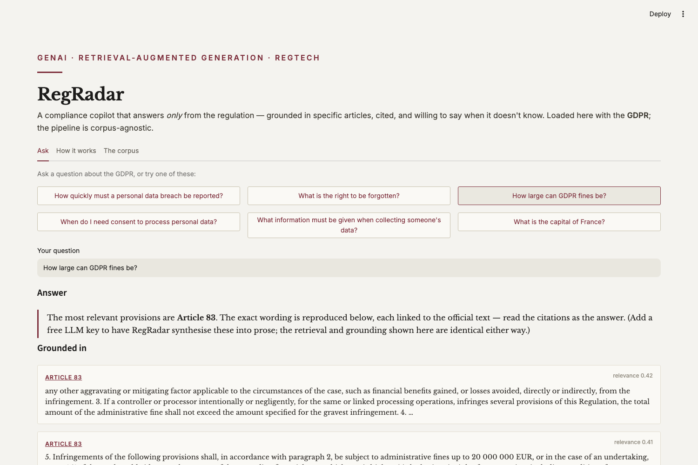

# RegRadar — Compliance Copilot

**A retrieval-augmented Q&A copilot that answers _only_ from the regulation — grounded in specific articles, cited, and willing to refuse when a question isn't supported by the text.**

**Live demo: https://drishtant-regradar.streamlit.app**

Loaded here with the **GDPR** (Regulation (EU) 2016/679). Ask a question and RegRadar retrieves the relevant articles, answers from them with citations, and — crucially — **declines when the regulation doesn't cover the question** instead of hallucinating an answer.



## What it shows

- **Real RAG** — the 99 GDPR articles are parsed into 240 citable chunks, embedded, and retrieved by semantic similarity. Every answer points back to the article it came from, linked to the official EUR-Lex text.
- **Knowing when not to answer** — a grounding threshold makes the system refuse low-confidence questions (try *“What is the capital of France?”*). For a compliance tool, a confident wrong answer is worse than “I don't know.”
- **$0 by default, upgradeable** — retrieval, citation and refusal run with no API key and no GPU. Add a free Groq/Gemini key to Streamlit secrets and a one-line switch turns on fluent LLM synthesis. The grounding is identical either way, so the demo is honest about what the LLM adds.
- **Corpus-agnostic** — nothing is GDPR-specific. Point `prep_corpus.py` at an AML/CTF Act, AUSTRAC guidance or an internal policy and the same pipeline applies.

## How it works

```
prep_corpus.py  →  parses the EUR-Lex GDPR HTML into 240 article-tagged chunks
rag.py          →  model2vec static embeddings, cosine retrieval, the grounding/
                   refusal gate, and optional Groq LLM synthesis
app.py          →  the interface: ask, grounded answer, cited passages
```

**Why model2vec for embeddings?** Transformer embedding models need PyTorch and slow cold starts. model2vec distils them into static vectors — genuine semantic search, pure-NumPy inference, ~30 MB, no GPU — so the app loads fast and costs nothing without dropping to keyword search.

## Run it locally

```bash
git clone https://github.com/drishtantleuva/regradar.git
cd regradar
python3 -m venv venv && source venv/bin/activate
pip install -r requirements.txt
python prep_corpus.py        # builds data/corpus.json from the GDPR text
streamlit run app.py
```

To enable LLM-synthesised answers, add a free [Groq](https://console.groq.com) key to `.streamlit/secrets.toml`:

```toml
GROQ_API_KEY = "gsk_…"
```

## Data

[**Regulation (EU) 2016/679 (GDPR)**](https://eur-lex.europa.eu/legal-content/EN/TXT/?uri=CELEX:32016R0679) — official consolidated text from EUR-Lex. EU legal texts are reusable under Commission Decision 2011/833/EU with attribution.

## Caveats

RegRadar is a demonstration of grounded retrieval, not legal advice. The grounding threshold is tuned for this corpus; retrieval can still surface a related-but-not-exact article. Answer synthesis (when enabled) is constrained to the retrieved passages but, like any LLM, should be verified against the cited source.

---

Built by **Drishtant Leuva** — Data Scientist specialising in GenAI, RAG and RegTech, with industry experience automating regulatory-compliance checks.
[LinkedIn](https://www.linkedin.com/in/drishtant-leuva/) · drishtantl@gmail.com
